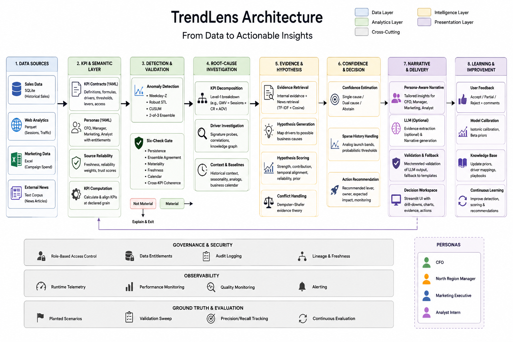

# TrendLens

TrendLens is a KPI Intelligence-to-Action Engine that transforms business KPI
movements into evidence-backed explanations, confidence-aware insights, and
practical recommendations.

It is designed to bridge the gap between traditional KPI monitoring and
business decision-making by combining governed KPI definitions, deterministic
analytics, statistical detection, evidence retrieval, hypothesis ranking,
uncertainty handling, persona-aware narratives, and feedback-driven
calibration.

## Table of contents

- Requirements
- Installation
- Configuration
- Architecture
- Key capabilities
- Analytical methods
- Data sources
- Usage
- Validation
- Troubleshooting
- FAQ

## Requirements

TrendLens requires Python 3.10+ and the following main packages:

- streamlit
- pandas
- numpy
- pyyaml
- openpyxl
- pyarrow
- statsmodels
- scikit-learn

An LLM is optional. TrendLens can run with deterministic templates without
an external model. Optional backends include local Ollama and API-based LLM
providers configured by the application.

## Installation

1. Clone or extract the project.

2. Open the project directory:

   ```bash
   cd trendlens
   ```

3. Install the Python dependencies:

   ```bash
   pip install -r requirements.txt
   ```

4. Start the Streamlit application:

   ```bash
   streamlit run app.py
   ```

5. Open the Streamlit URL shown in the terminal.

## Configuration

TrendLens uses configuration files to govern KPI definitions, personas, and
source reliability.

### KPI contracts

KPI contracts define the business meaning and analytical rules for each KPI,
including:

- Definition
- Formula
- Data source
- Grain
- Drivers
- Materiality and freshness rules
- Access requirements
- Available business levers

Contracts are stored in the `contracts/` directory.

### Personas

Role-specific output is configured in `personas.yaml`.

The prototype includes:

- CFO
- North Regional Manager
- Marketing Executive
- Analyst Intern

Each persona receives an appropriate level of aggregation, vocabulary,
decision rights, and recommended actions.

### Source reliability

Initial source reliability values are configured in
`source_reliability.yaml`. These values are used when ranking evidence and
hypotheses.

### LLM configuration

The application supports:

- Deterministic template generation
- Local Ollama
- Anthropic API
- OpenAI API

The LLM is optional and is not used as the source of quantitative truth.

## Architecture

TrendLens follows a hybrid KPI intelligence pipeline that converts raw
business data into evidence-backed and actionable insights.



The architecture is supported by cross-cutting capabilities for governance and
security, observability, and ground-truth evaluation.

### Core flow

```text
Data Sources
    |
    +--> Sales SQLite
    +--> Web Analytics Parquet
    +--> Marketing Excel
    +--> External News
             |
             v
     KPI Semantic Layer
             |
             v
   KPI History & Reconciliation
             |
             v
    Movement Detection
             |
             v
      Six-Check Gate
             |
             v
   Root-Cause Investigation
             |
             v
 Evidence Retrieval + Hypotheses
             |
             v
 Confidence / Abstention
             |
             v
      Action Intelligence
             |
             v
     Persona-Aware Narrative
             |
             v
       Streamlit Workspace
             |
             v
       Feedback & Calibration
```

## Key capabilities

- **KPI governance** through semantic contracts with definitions, formulas,
  grains, sources, drivers, thresholds, access rules, and business levers.
- **Material KPI detection** that prioritizes meaningful movements rather than
  every normal fluctuation.
- **Multi-source reconciliation** across different grains, refresh cadences,
  source reliability, and data-quality conditions.
- **Root-cause investigation** using decomposition, signature probes,
  historical context, and knowledge-graph relationships.
- **Evidence-based hypothesis ranking** using internal measurements and
  retrieved external evidence.
- **Confidence and abstention** with single-cause, dual-cause, and abstain
  outcomes.
- **Sparse-history handling** for new KPIs and product launches using an
  analog-based detection branch.
- **Persona-aware insights** for executive, regional, marketing, and
  read-only analyst users.
- **Action recommendations** mapped to business levers and decision rights.
- **Optional LLM assistance** for structured external-evidence extraction and
  persona-specific narrative generation.
- **Feedback and calibration** using analyst feedback, Beta priors, and
  isotonic calibration.
- **Auditability and observability** through evidence references, lineage,
  freshness information, audit logs, and runtime telemetry.

## Analytical methods

TrendLens uses a hybrid analytical approach. Quantitative decisions are
performed by deterministic and statistical components rather than by the LLM.

### KPI computation

**GMV**

$$
GMV = \sum_{i=1}^{n}
Qty_i \times ListPrice_i \times (1-DiscountPct_i)
$$

Only completed orders are included.

**Orders**

$$
Orders = COUNT(DISTINCT\ OrderID)
$$

Only completed orders are included.

**Average Order Value**

$$
AOV = \frac{GMV}{Orders}
$$

**Sessions**

$$
Sessions = \sum_{i=1}^{n} Sessions_i
$$

**Conversion Rate**

$$
ConversionRate = \frac{Orders}{Sessions} \times 100
$$

**Net Revenue**

$$
NetRevenue = GMV - Returns - Cancellations
$$

**Marketing Spend**

$$
MarketingSpend = \sum_{i=1}^{n} Spend_i
$$

### KPI decomposition

GMV is investigated using the relationship:

$$
GMV \approx Sessions \times ConversionRate \times AOV
$$

The Level-1 components are:

- Sessions
- Conversion Rate
- AOV

AOV can be investigated further through price/mix and interaction effects.

### Weekday-Z detection

TrendLens compares a KPI with historical observations for the same weekday.

$$
Baseline = Median(X_{same\ weekday})
$$

$$
MAD = Median\left(\left|X_i-Median(X)\right|\right)
$$

$$
RobustScale = 1.4826 \times MAD
$$

$$
Z_{robust} =
\frac{X_t-Baseline}{RobustScale}
$$

A rolling standard-deviation fallback is used when MAD is effectively zero.

### Robust STL

For KPIs with sufficient history, TrendLens uses robust STL
(Seasonal-Trend decomposition using LOESS):

$$
X_t = T_t + S_t + R_t
$$

where `T` is trend, `S` is seasonality, and `R` is the residual component.

The implementation uses a weekly seasonal period and robust residual
scaling.

### CUSUM

TrendLens uses a two-sided CUSUM detector on standardized residuals:

$$
C_t^{+} = \max\left(0, C_{t-1}^{+} + x_t - k\right)
$$

$$
C_t^{-} = \min\left(0, C_{t-1}^{-} + x_t + k\right)
$$

A signal occurs when:

$$
C_t^{+} > h\quad\text{or}\quad C_t^{-} < -h
$$

The implemented detector uses:

k = 0.5
h = 4.0

### Ensemble detection

The detector combines:

- Weekday-Z
- Robust STL
- CUSUM

A candidate requires a weekday-Z anchor and support from at least two of the
three detectors.

### Six-check validation gate

Candidate KPI movements are validated using:

1. Persistence
2. Ensemble agreement
3. Business materiality
4. Data freshness
5. Business calendar context
6. Cross-KPI coherence

The gate helps reject transient spikes, expected events, stale data, and
immaterial movements.

### Driver investigation

TrendLens investigates potential drivers using:

- KPI decomposition
- Discount and pricing signatures
- Organic versus paid traffic contrasts
- Campaign coverage
- Funnel-step analysis
- Inventory and stockout scans
- Launch-SKU share
- Knowledge-graph relationships
- Historical context

### Evidence retrieval

External news evidence is retrieved using:

- TF-IDF
- Cosine similarity
- Temporal relevance priors

Cosine similarity is:

$$
\cos(\theta)=
\frac{A\cdot B}{\lVert A\rVert\lVert B\rVert}
$$

External evidence corroborates or challenges an internally measured hypothesis;
it does not quantify KPI impact.

### Hypothesis ranking

Candidate drivers are ranked using:

$$
\begin{aligned}
Score ={}&
0.30\times EvidenceStrength \\
&+0.15\times TemporalAlignment \\
&+0.20\times SourceReliability \\
&+0.20\times ContributionMatch \\
&+0.15\times HistoricalPrecedent
\end{aligned}
$$

The score is additionally adjusted for refuting evidence, missing critical
evidence, causal-test results, sparse history, and evidence conflict.

### Confidence and abstention

TrendLens can return:

- **Single cause** when one explanation clearly dominates.
- **Dual cause** when two distinct drivers are sufficiently strong.
- **Abstain** when evidence is insufficient, too close, or contradictory.

The implemented decision thresholds include:

$$
\tau = 0.55,
\qquad
\Delta = 0.15,
\qquad
\kappa_{max}=0.50
$$

### Confidence calibration

Driver feedback is maintained using Beta priors:

$$
P(driver)=Beta(\alpha,\beta)
$$

Feedback updates the prior:

$$
Confirm \rightarrow \alpha \uparrow
$$

$$
Reject \rightarrow \beta \uparrow
$$

After sufficient samples, isotonic calibration using PAV
(Pool Adjacent Violators) is applied.

### LLM boundary

The LLM is deliberately kept outside the quantitative decision core.

**Deterministic / statistical layer**

- KPI calculations
- Anomaly detection
- KPI decomposition
- Contribution measurement
- Hypothesis scoring
- Confidence logic
- Business rules

**Optional LLM layer**

- Structured external-evidence extraction
- Persona-specific narrative generation

Generated narratives are mechanically checked for evidence citations and
numerical consistency. If validation fails, TrendLens falls back to a
deterministic template.

## Data sources

The prototype combines heterogeneous sources to demonstrate reconciliation
and evidence-based investigation.

| Source | Format | Example role |
| --- | --- | --- |
| Sales | SQLite | Orders, GMV, returns, cancellations |
| Web analytics | Parquet | Sessions and funnel metrics |
| Marketing | Excel | Campaign and spend information |
| News | Local corpus | External contextual evidence |

The prototype intentionally includes differences in cadence, grain,
freshness, and data quality to test realistic analytical conditions.

## Usage

Start the application with:

```bash
streamlit run app.py
```

The Streamlit workspace allows the user to:

1. Select a business persona.
2. Select or inspect a governed KPI.
3. Review material KPI movements.
4. Inspect supporting analytical evidence.
5. Review ranked drivers and confidence.
6. Review recommended actions.
7. Inspect the generated narrative and evidence references.
8. Provide feedback for later calibration.

## Validation

TrendLens includes a validation sweep against planted ground-truth
scenarios.

Run:

```bash
python validate_sweep.py
```

The validation covers scenarios such as:

- Coupon expiry
- Competitor sale
- Ambiguous multi-factor movement
- New-product launch
- Gateway disruption
- Stockout

The validation checks whether TrendLens detects true material movements,
rejects expected or transient movements, handles sparse history, and provides
appropriate reason codes.

### Validation layers

- **KPI contract validation** ensures governed definitions are used.
- **Data validation** checks freshness, completeness, source reliability, and
  reconciliation conditions.
- **Movement validation** applies the six-check gate.
- **Root-cause validation** checks contribution, temporal alignment, evidence,
  reliability, and refuting information.
- **Evidence validation** ensures external evidence supports or challenges
  rather than numerically determines a hypothesis.
- **Narrative validation** checks citations and numerical consistency.
- **Feedback validation** feeds analyst outcomes through the calibration path.
- **Runtime validation** records latency, model calls, token usage, and
  estimated cost.

## Troubleshooting

### Streamlit does not start

Verify that the dependencies are installed:

```bash
pip install -r requirements.txt
```

Then run:

```bash
streamlit run app.py
```

### No LLM is configured

No external LLM is required. Select the deterministic template option in the
application to run the narrative layer without an LLM.

### Results appear stale

Check the underlying data sources and their refresh timestamps. TrendLens
explicitly considers source freshness when validating KPI movements.

### A new KPI has insufficient history

TrendLens uses an analog-based branch for sparse or newly launched KPIs rather
than forcing the normal seasonal detector when sufficient history is
unavailable.

## FAQ

**Q: Does TrendLens require an LLM?**

A: No. The prototype can run with deterministic narrative generation.

**Q: Is the LLM responsible for calculating KPI values?**

A: No. KPI computation, anomaly detection, decomposition, contribution
measurement, hypothesis scoring, and confidence logic are handled by
deterministic and statistical components.

**Q: What happens when evidence is insufficient?**

A: TrendLens can abstain instead of forcing a root-cause explanation.

**Q: How does TrendLens handle multiple possible causes?**

A: It can return a dual-cause explanation when two distinct drivers are both
sufficiently supported.

**Q: How are external news sources used?**

A: They provide contextual evidence that can corroborate or challenge an
internal hypothesis. They are not used to calculate KPI impact.

**Q: How does TrendLens handle new KPIs or products?**

A: Sparse-history KPIs use an analog-based detection branch when normal
seasonal methods do not have enough history.

**Q: Can different users receive different insights?**

A: Yes. Persona configuration controls aggregation, vocabulary, decision
rights, and recommended actions.

**Q: Can the system learn from analyst feedback?**

A: Yes. Feedback is replayed through the calibration path and updates driver
priors and calibrated confidence when sufficient samples are available.
